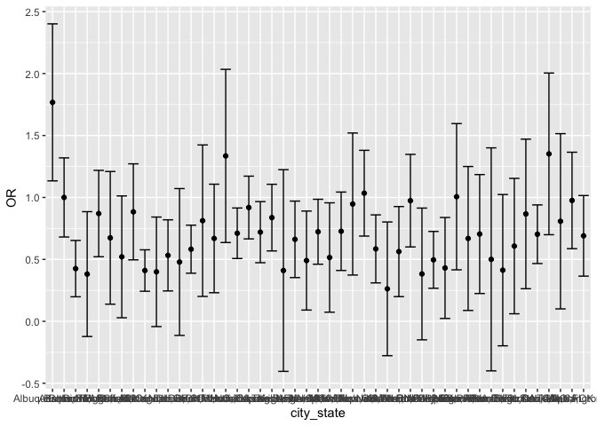
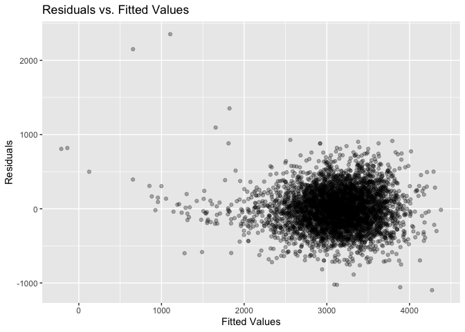

p8105_hw6
================
Qingzhen Sun
2022-12-01

``` r
library(tidyverse)
```

    ## ── Attaching packages ─────────────────────────────────────── tidyverse 1.3.2 ──
    ## ✔ ggplot2 3.4.0      ✔ purrr   0.3.4 
    ## ✔ tibble  3.1.8      ✔ dplyr   1.0.10
    ## ✔ tidyr   1.2.1      ✔ stringr 1.4.1 
    ## ✔ readr   2.1.2      ✔ forcats 0.5.2 
    ## ── Conflicts ────────────────────────────────────────── tidyverse_conflicts() ──
    ## ✖ dplyr::filter() masks stats::filter()
    ## ✖ dplyr::lag()    masks stats::lag()

``` r
library(modelr)
```

## Problem 2

#### Load the raw data, and discrible the raw data.

``` r
urlfile = "https://raw.githubusercontent.com/washingtonpost/data-homicides/master/homicide-data.csv"
homi_data = read_csv(url(urlfile))%>%
  janitor::clean_names()
```

    ## Rows: 52179 Columns: 12
    ## ── Column specification ────────────────────────────────────────────────────────
    ## Delimiter: ","
    ## chr (9): uid, victim_last, victim_first, victim_race, victim_age, victim_sex...
    ## dbl (3): reported_date, lat, lon
    ## 
    ## ℹ Use `spec()` to retrieve the full column specification for this data.
    ## ℹ Specify the column types or set `show_col_types = FALSE` to quiet this message.

``` r
dim(homi_data)
```

    ## [1] 52179    12

#### Tidy the raw data and adding new variables.

``` r
tidy_homi = homi_data%>%
  mutate(city_state = str_c(city, ",", state))%>%
  mutate(situation = (disposition == "Closed by arrest"))%>%
  mutate(victim_age = as.numeric(victim_age))%>%
  filter(victim_race == "White"| victim_race== "Black")%>%
  filter(!city_state %in% c("Dallas,TX", "Phoenix,AZ", "Kansas City,MO", "Tulsa,AL"))
```

    ## Warning in mask$eval_all_mutate(quo): NAs introduced by coercion

#### Fit in the model and do analysis for city Baltimore

``` r
homi_BD = tidy_homi%>%
  filter(city_state == "Baltimore,MD")%>%
  select(situation, victim_race, victim_age, victim_sex)%>%
  glm(situation ~ victim_race + victim_sex + victim_age, data = ., family = "binomial" )%>%
  broom::tidy() %>%
  mutate(OR = exp(estimate),
         OR_lower = OR - qnorm(0.95)*std.error,
         OR_upper = OR + qnorm(0.95)*std.error)%>%
  select(OR, OR_lower, OR_upper, estimate)%>%
  save(file = "result/homi_BD.RData")
```

#### fit model for each city.

``` r
city_nest = 
  tidy_homi %>%
  select(city_state,situation, victim_race, victim_age, victim_sex) %>%
  nest(data = -city_state)%>%
  mutate(
    model  = map(.x = data,  ~glm(situation ~ victim_race + victim_sex + victim_age, data = .x, family = "binomial" )),
    result = map(model, broom::tidy))%>%
  unnest(result)%>%
  filter(term == "victim_sexMale")%>%
  mutate(OR = exp(estimate),
         OR_lower = OR - qnorm(0.95)*std.error,
         OR_upper = OR + qnorm(0.95)*std.error)%>%
  select(city_state, OR, OR_lower, OR_upper)
  
city_nest
```

    ## # A tibble: 47 × 4
    ##    city_state        OR OR_lower OR_upper
    ##    <chr>          <dbl>    <dbl>    <dbl>
    ##  1 Albuquerque,NM 1.77    1.13      2.40 
    ##  2 Atlanta,GA     1.00    0.681     1.32 
    ##  3 Baltimore,MD   0.426   0.198     0.653
    ##  4 Baton Rouge,LA 0.381  -0.122     0.885
    ##  5 Birmingham,AL  0.870   0.521     1.22 
    ##  6 Boston,MA      0.674   0.138     1.21 
    ##  7 Buffalo,NY     0.521   0.0289    1.01 
    ##  8 Charlotte,NC   0.884   0.496     1.27 
    ##  9 Chicago,IL     0.410   0.243     0.577
    ## 10 Cincinnati,OH  0.400  -0.0423    0.842
    ## # … with 37 more rows

#### plot the graph for each city.

``` r
plot_city = city_nest%>%
  ggplot(aes(x = city_state, y = OR))+
  geom_point()+
  geom_errorbar(aes(ymin = OR_lower, ymax = OR_upper))
plot_city
```

<!-- --> \##
problem3

#### load data and clean.

``` r
bwt_data = read_csv("data/birthweight.csv")%>%
  janitor::clean_names()%>%
  mutate(
    babysex = factor(babysex),
    frace = factor(frace),
    malform = factor(malform),
    mrace = factor(mrace)
  ) 
```

    ## Rows: 4342 Columns: 20
    ## ── Column specification ────────────────────────────────────────────────────────
    ## Delimiter: ","
    ## dbl (20): babysex, bhead, blength, bwt, delwt, fincome, frace, gaweeks, malf...
    ## 
    ## ℹ Use `spec()` to retrieve the full column specification for this data.
    ## ℹ Specify the column types or set `show_col_types = FALSE` to quiet this message.

#### regression model for bwt using backward model.

``` r
module_0 = lm(bwt ~., data = bwt_data) 
step(module_0, direction = "backward") %>% broom::tidy()
```

    ## Start:  AIC=48717.83
    ## bwt ~ babysex + bhead + blength + delwt + fincome + frace + gaweeks + 
    ##     malform + menarche + mheight + momage + mrace + parity + 
    ##     pnumlbw + pnumsga + ppbmi + ppwt + smoken + wtgain
    ## 
    ## 
    ## Step:  AIC=48717.83
    ## bwt ~ babysex + bhead + blength + delwt + fincome + frace + gaweeks + 
    ##     malform + menarche + mheight + momage + mrace + parity + 
    ##     pnumlbw + pnumsga + ppbmi + ppwt + smoken
    ## 
    ## 
    ## Step:  AIC=48717.83
    ## bwt ~ babysex + bhead + blength + delwt + fincome + frace + gaweeks + 
    ##     malform + menarche + mheight + momage + mrace + parity + 
    ##     pnumlbw + ppbmi + ppwt + smoken
    ## 
    ## 
    ## Step:  AIC=48717.83
    ## bwt ~ babysex + bhead + blength + delwt + fincome + frace + gaweeks + 
    ##     malform + menarche + mheight + momage + mrace + parity + 
    ##     ppbmi + ppwt + smoken
    ## 
    ##            Df Sum of Sq       RSS   AIC
    ## - frace     4    124365 320848704 48712
    ## - malform   1      1419 320725757 48716
    ## - ppbmi     1      6346 320730684 48716
    ## - momage    1     28661 320752999 48716
    ## - mheight   1     66886 320791224 48717
    ## - menarche  1    111679 320836018 48717
    ## - ppwt      1    131132 320855470 48718
    ## <none>                  320724338 48718
    ## - fincome   1    193454 320917792 48718
    ## - parity    1    413584 321137922 48721
    ## - mrace     3    868321 321592659 48724
    ## - babysex   1    853796 321578134 48727
    ## - gaweeks   1   4611823 325336161 48778
    ## - smoken    1   5076393 325800732 48784
    ## - delwt     1   8008891 328733230 48823
    ## - blength   1 102050296 422774634 49915
    ## - bhead     1 106535716 427260054 49961
    ## 
    ## Step:  AIC=48711.51
    ## bwt ~ babysex + bhead + blength + delwt + fincome + gaweeks + 
    ##     malform + menarche + mheight + momage + mrace + parity + 
    ##     ppbmi + ppwt + smoken
    ## 
    ##            Df Sum of Sq       RSS   AIC
    ## - malform   1      1447 320850151 48710
    ## - ppbmi     1      6975 320855679 48710
    ## - momage    1     28379 320877083 48710
    ## - mheight   1     69502 320918206 48710
    ## - menarche  1    115708 320964411 48711
    ## - ppwt      1    133961 320982665 48711
    ## <none>                  320848704 48712
    ## - fincome   1    194405 321043108 48712
    ## - parity    1    414687 321263390 48715
    ## - babysex   1    852133 321700837 48721
    ## - gaweeks   1   4625208 325473911 48772
    ## - smoken    1   5036389 325885093 48777
    ## - delwt     1   8013099 328861802 48817
    ## - mrace     3  13540415 334389119 48885
    ## - blength   1 101995688 422844392 49908
    ## - bhead     1 106662962 427511666 49956
    ## 
    ## Step:  AIC=48709.53
    ## bwt ~ babysex + bhead + blength + delwt + fincome + gaweeks + 
    ##     menarche + mheight + momage + mrace + parity + ppbmi + ppwt + 
    ##     smoken
    ## 
    ##            Df Sum of Sq       RSS   AIC
    ## - ppbmi     1      6928 320857079 48708
    ## - momage    1     28660 320878811 48708
    ## - mheight   1     69320 320919470 48708
    ## - menarche  1    116027 320966177 48709
    ## - ppwt      1    133894 320984044 48709
    ## <none>                  320850151 48710
    ## - fincome   1    193784 321043934 48710
    ## - parity    1    414482 321264633 48713
    ## - babysex   1    851279 321701430 48719
    ## - gaweeks   1   4624003 325474154 48770
    ## - smoken    1   5035195 325885346 48775
    ## - delwt     1   8029079 328879230 48815
    ## - mrace     3  13553320 334403471 48883
    ## - blength   1 102009225 422859375 49906
    ## - bhead     1 106675331 427525481 49954
    ## 
    ## Step:  AIC=48707.63
    ## bwt ~ babysex + bhead + blength + delwt + fincome + gaweeks + 
    ##     menarche + mheight + momage + mrace + parity + ppwt + smoken
    ## 
    ##            Df Sum of Sq       RSS   AIC
    ## - momage    1     29211 320886290 48706
    ## - menarche  1    117635 320974714 48707
    ## <none>                  320857079 48708
    ## - fincome   1    195199 321052278 48708
    ## - parity    1    412984 321270064 48711
    ## - babysex   1    850020 321707099 48717
    ## - mheight   1   1078673 321935752 48720
    ## - ppwt      1   2934023 323791103 48745
    ## - gaweeks   1   4621504 325478583 48768
    ## - smoken    1   5039368 325896447 48773
    ## - delwt     1   8024939 328882018 48813
    ## - mrace     3  13551444 334408523 48881
    ## - blength   1 102018559 422875638 49904
    ## - bhead     1 106821342 427678421 49953
    ## 
    ## Step:  AIC=48706.02
    ## bwt ~ babysex + bhead + blength + delwt + fincome + gaweeks + 
    ##     menarche + mheight + mrace + parity + ppwt + smoken
    ## 
    ##            Df Sum of Sq       RSS   AIC
    ## - menarche  1    100121 320986412 48705
    ## <none>                  320886290 48706
    ## - fincome   1    240800 321127090 48707
    ## - parity    1    431433 321317724 48710
    ## - babysex   1    841278 321727568 48715
    ## - mheight   1   1076739 321963029 48719
    ## - ppwt      1   2913653 323799943 48743
    ## - gaweeks   1   4676469 325562760 48767
    ## - smoken    1   5045104 325931394 48772
    ## - delwt     1   8000672 328886962 48811
    ## - mrace     3  14667730 335554021 48894
    ## - blength   1 101990556 422876847 49902
    ## - bhead     1 106864308 427750598 49952
    ## 
    ## Step:  AIC=48705.38
    ## bwt ~ babysex + bhead + blength + delwt + fincome + gaweeks + 
    ##     mheight + mrace + parity + ppwt + smoken
    ## 
    ##           Df Sum of Sq       RSS   AIC
    ## <none>                 320986412 48705
    ## - fincome  1    245637 321232048 48707
    ## - parity   1    422770 321409181 48709
    ## - babysex  1    846134 321832545 48715
    ## - mheight  1   1012240 321998651 48717
    ## - ppwt     1   2907049 323893461 48743
    ## - gaweeks  1   4662501 325648912 48766
    ## - smoken   1   5073849 326060260 48771
    ## - delwt    1   8137459 329123871 48812
    ## - mrace    3  14683609 335670021 48894
    ## - blength  1 102191779 423178191 49903
    ## - bhead    1 106779754 427766166 49950

    ## # A tibble: 14 × 5
    ##    term         estimate std.error statistic   p.value
    ##    <chr>           <dbl>     <dbl>     <dbl>     <dbl>
    ##  1 (Intercept) -6099.      138.       -44.3  0        
    ##  2 babysex2       28.6       8.45       3.38 7.37e-  4
    ##  3 bhead         131.        3.45      37.9  3.10e-272
    ##  4 blength        74.9       2.02      37.1  4.29e-262
    ##  5 delwt           4.11      0.392     10.5  2.26e- 25
    ##  6 fincome         0.318     0.175      1.82 6.88e-  2
    ##  7 gaweeks        11.6       1.46       7.93 2.79e- 15
    ##  8 mheight         6.59      1.78       3.69 2.23e-  4
    ##  9 mrace2       -139.        9.91     -14.0  1.21e- 43
    ## 10 mrace3        -74.9      42.3       -1.77 7.68e-  2
    ## 11 mrace4       -101.       19.3       -5.21 1.98e-  7
    ## 12 parity         96.3      40.3        2.39 1.70e-  2
    ## 13 ppwt           -2.68      0.427     -6.26 4.20e- 10
    ## 14 smoken         -4.84      0.586     -8.27 1.75e- 16

``` r
module_1 = lm(bwt ~ babysex + bhead + blength + fincome + delwt + gaweeks + mheight + mrace + parity + ppwt + smoken, data = bwt_data)
```

#### model residuals against fitted values – use add_predictions and add_residuals

``` r
bwt_data %>% 
  add_predictions(module_1) %>% 
  add_residuals(module_1) %>% 
  ggplot(aes(x = pred, y = resid)) +
  geom_point(alpha = 0.3) +
  labs(
    x = "Fitted Values",
    y = "Residuals",
    title = "Residuals vs. Fitted Values"
  )
```

<!-- -->

#### Other modle for bwt prediciton.

``` r
module_2 = lm(bwt ~ blength + gaweeks, data = bwt_data) 
module_3 = lm(bwt ~ bhead + blength + babysex + bhead * blength * gaweeks, data = bwt_data)
```

#### three modules comparison.

``` r
cv_data =
  crossv_mc(bwt_data, 100) %>% 
  mutate(
    train = map(train, as_tibble), 
    test = map(test, as_tibble)
  ) %>% 
  mutate(
    module_1 = map(.x = train, ~lm(bwt ~ babysex + bhead + blength + fincome + delwt + gaweeks + mheight + mrace + parity + ppwt + smoken, data = .x)), 
    module_2 = map(.x = train, ~lm(bwt ~ blength + gaweeks, data = .x)),
    module_3 = map(.x = train, ~lm(bwt ~ bhead + blength + babysex + bhead * blength * gaweeks, data = .x))
  ) %>% 
  mutate(
    rmse_fit1 = map2_dbl(.x = module_1, .y = test, ~rmse(model = .x, data = .y)),
    rmse_fit2 = map2_dbl(.x = module_2, .y = test, ~rmse(model = .x, data = .y)),
    rmse_fit3 = map2_dbl(.x = module_3, .y = test, ~rmse(model = .x, data = .y))
  )
```

    ## Warning in predict.lm(model, data): prediction from a rank-deficient fit may be
    ## misleading

``` r
cv_data %>% 
  summarize(
     rmse_fit1_avg = mean(rmse_fit1),
     rmse_fit2_avg = mean(rmse_fit2),
     rmse_fit3_avg = mean(rmse_fit3)
  )
```

    ## # A tibble: 1 × 3
    ##   rmse_fit1_avg rmse_fit2_avg rmse_fit3_avg
    ##           <dbl>         <dbl>         <dbl>
    ## 1          273.          332.          285.

From the result above, the best modle is module_1 which used the
backward selection since it has the lowest rmse value. The 2nd choice is
module_3 which used the three way interaction. And the modle_2 is the
worse one since it has the highest rmse value.
